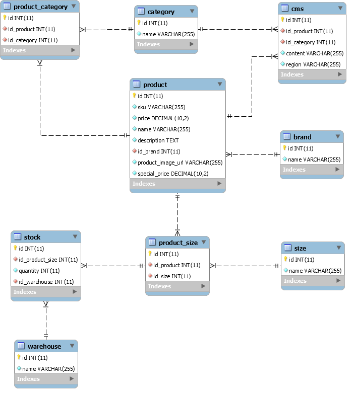

# Case Study Tech

## First task

### Primeira Opção
- Modelo relacional
- MySQL ou PostgreSQL
- Garante consistência dos dados mas não é tão perfomático quanto um não-relacional
- Script de estrutura do banco de dados (data/DDL.sql)
- 

### Segunda Opção
- Modelo não-relacional
- MongoDB, Cassandra
- Alta performance porém não garante consistência dos dados

## Second task

Para realizar o cache das requisições, sugiro construir um middleware para armazenar as requisições no REDIS e verificar se a requisição se encontra em cache e retorna-la.

- Executar o composer para instalar as dependências
- Criar um banco MySQL e executar os arquivos DDL.sql e DML.sql
- Executar o composer para instalar as dependências
- Atualizar o arquivo config/autoload/doctrine.local.php com as configurações da instância MySQL criada
- Para testar a validação desenvolvidada, envie uma requisição POST para "/catalog" com o conteúdo do arquivo JSON ou execute o arquivo php "test_wms.php"
### WSM webservice
GET:
/wms

### Catalog webservice
POST:
/catalog
Input: Json

### CMS webservice
GET:
/cms/category/{category}

GET:
/cms/sku/{sku}

### CMS webservice
GET:
/cms/category/{category}

GET:
/cms/sku/{sku}

### Stock webservice
GET:
/stock/{sku}/{size}

## Third task

